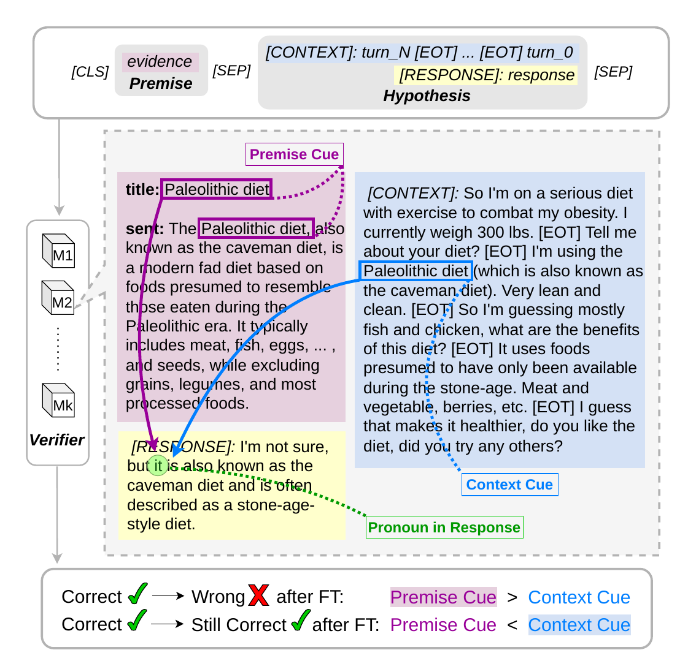

# Better Scores, Worse Grounding

[**Paper (SIGDIAL 2026)**](https://aclanthology.org/2026.sigdial-1.51/)

> **TL;DR:** Fine-tuning improved Macro-F1 across all 18 model–evaluation-set comparisons, yet newly regressed dialogue cases showed stronger premise-side sensitivity than stable-correct cases under the Premise-Preference Score (PPS) in 17 of 18 comparisons.

<p align="center">
  
</p>

<p align="center"><em>Aggregate gains can conceal regressions on context-dependent dialogue cases.</em></p>

This repository provides the training and evaluation code, PPS implementation, and post-adjudication audit data for the paper.

## Repository

```text
data/
├── df_coref_valid.jsonl
├── df_coref_test.jsonl
├── fd_random.jsonl
└── fd_topic.jsonl

src/
├── data.py
├── model.py
├── train.py
├── evaluate.py
└── pps.py
```

The four JSONL files are audit sets, not training splits. Fine-tuning requires a prepared DialFact or FaithDial training file.

## Setup

```bash
git clone https://github.com/dweebee/better-scores-worse-grounding.git
cd better-scores-worse-grounding

python -m venv .venv
source .venv/bin/activate
python -m pip install -r requirements.txt
```

## Example

The commands below use DialFact and DeBERTa-v3-base. Files under `runs/` and `results/` are generated during execution; they are not included in the repository.

```bash
TRAIN_FILE=/path/to/prepared_dialfact_train.jsonl
MODEL_KEY=deberta-v3-base
BASE_MODEL=microsoft/deberta-v3-base
RUN_DIR=runs/dialfact/${MODEL_KEY}
AUDIT_FILE=data/df_coref_test.jsonl
RESULT_DIR=results/dialfact/${MODEL_KEY}
```

### Fine-tune

```bash
python src/train.py \
  --dataset dialfact \
  --model-key ${MODEL_KEY} \
  --model-name-or-path ${BASE_MODEL} \
  --train-file ${TRAIN_FILE} \
  --output-dir ${RUN_DIR} \
  --seed 7
```

This creates `${RUN_DIR}/initial` and `${RUN_DIR}/selected` for the plain-base example above.

### Evaluate

```bash
# Creates ${RESULT_DIR}/audit_predictions.csv
python src/evaluate.py \
  --dataset dialfact \
  --model-key ${MODEL_KEY} \
  --model-name-or-path ${RUN_DIR}/selected \
  --input-file ${AUDIT_FILE} \
  --output-file ${RESULT_DIR}/audit_predictions.csv
```

### Compute PPS

```bash
# Creates the fixed five-condition input used by both model states
python src/pps.py prepare \
  --dataset dialfact \
  --model-key ${MODEL_KEY} \
  --tokenizer-name-or-path ${RUN_DIR}/selected \
  --input-file ${AUDIT_FILE} \
  --output-file ${RESULT_DIR}/pps_variants.csv
```

```bash
# Reads pps_variants.csv and creates the pre-FT predictions
python src/evaluate.py \
  --dataset dialfact \
  --model-key ${MODEL_KEY} \
  --model-name-or-path ${RUN_DIR}/initial \
  --input-file ${RESULT_DIR}/pps_variants.csv \
  --output-file ${RESULT_DIR}/pre_ft_predictions.csv

# Reads the same variants and creates the post-FT predictions
python src/evaluate.py \
  --dataset dialfact \
  --model-key ${MODEL_KEY} \
  --model-name-or-path ${RUN_DIR}/selected \
  --input-file ${RESULT_DIR}/pps_variants.csv \
  --output-file ${RESULT_DIR}/post_ft_predictions.csv
```

```bash
# Creates pps_by_example.csv, transition_summary.csv, and pps_summary.json
python src/pps.py summarize \
  --pre-predictions ${RESULT_DIR}/pre_ft_predictions.csv \
  --post-predictions ${RESULT_DIR}/post_ft_predictions.csv \
  --output-dir ${RESULT_DIR}/pps
```

For an NLI-pretrained verifier, use its original checkpoint for the pre-FT evaluation instead of `${RUN_DIR}/initial`.

## Citation

```bibtex
@inproceedings{park-zubiaga-2026-better,
  title     = {Better Scores, Worse Grounding: Hidden Regressions after Fine-Tuning in Dialogue Fact Verification},
  author    = {Park, Hyunkyung and Zubiaga, Arkaitz},
  booktitle = {Proceedings of the 27th Annual Meeting of the Special Interest Group on Discourse and Dialogue},
  year      = {2026},
  pages     = {720--737},
  url       = {https://aclanthology.org/2026.sigdial-1.51/}
}
```
